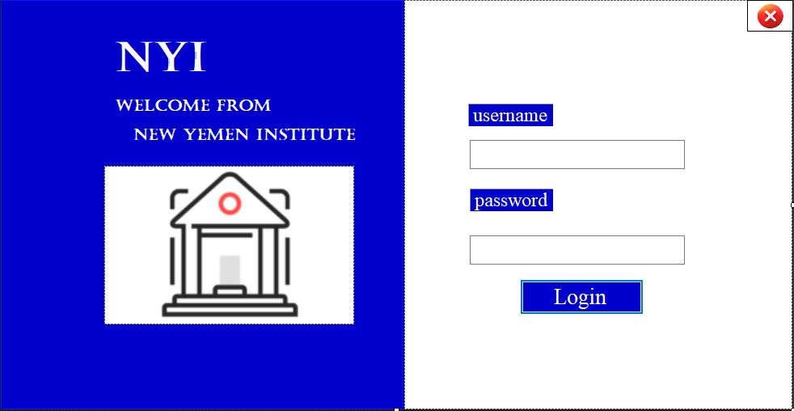
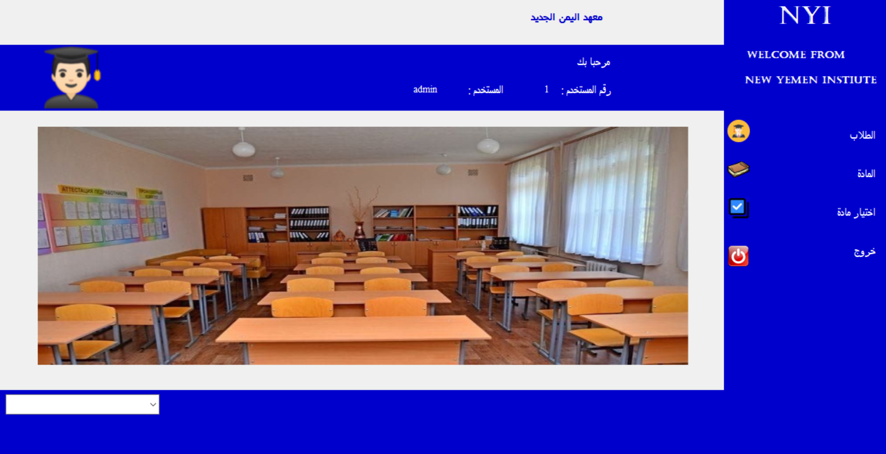
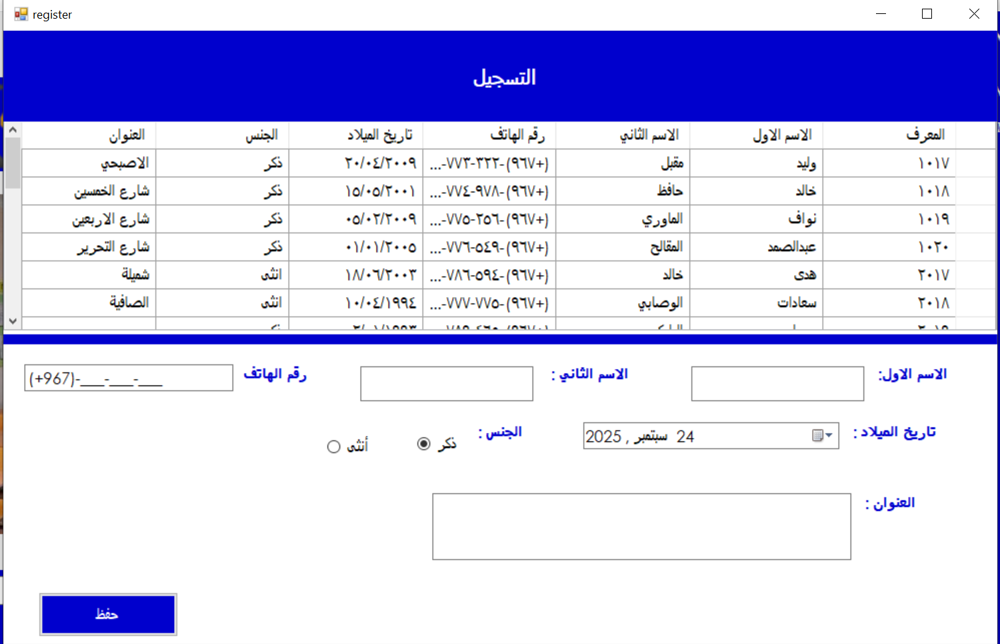
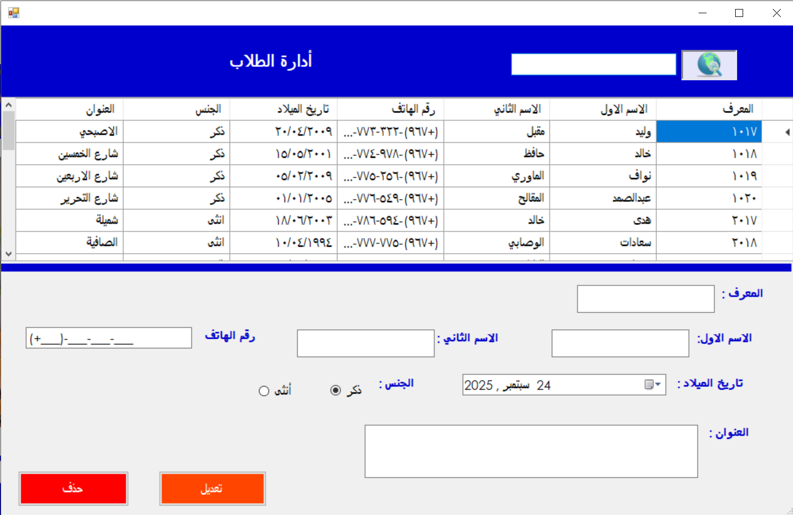
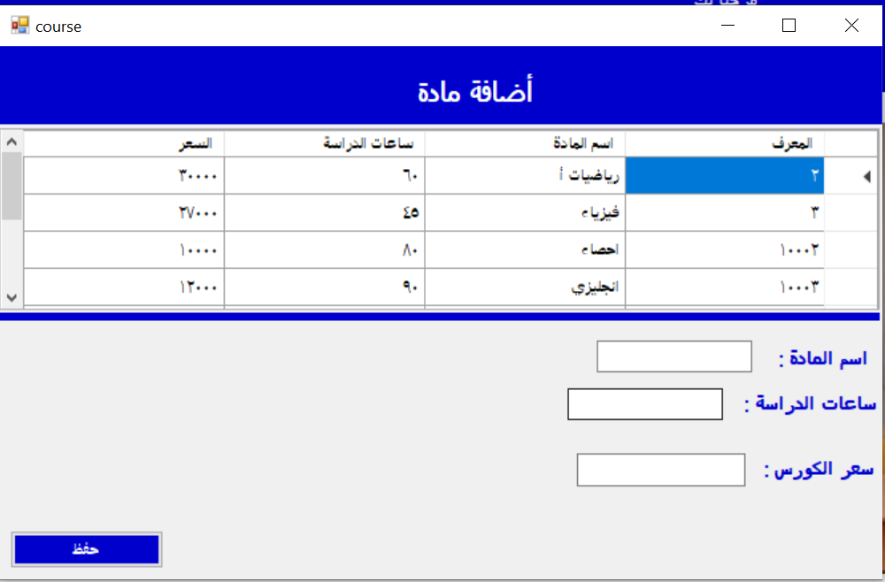
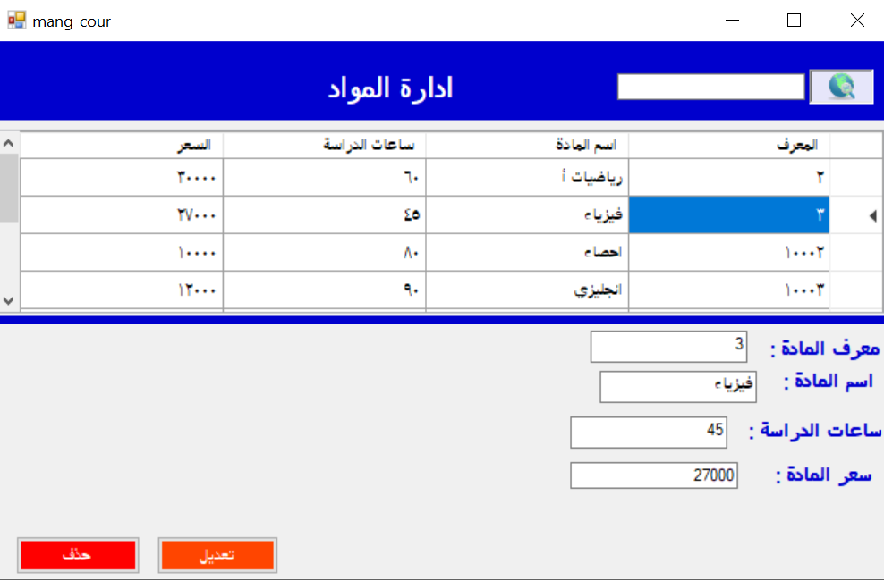
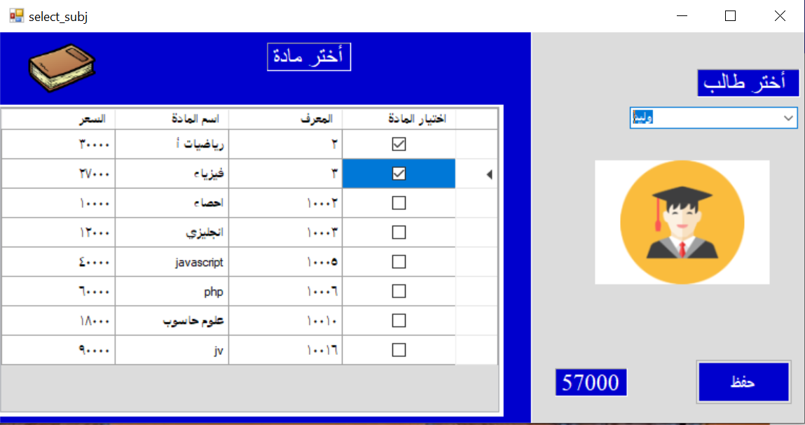
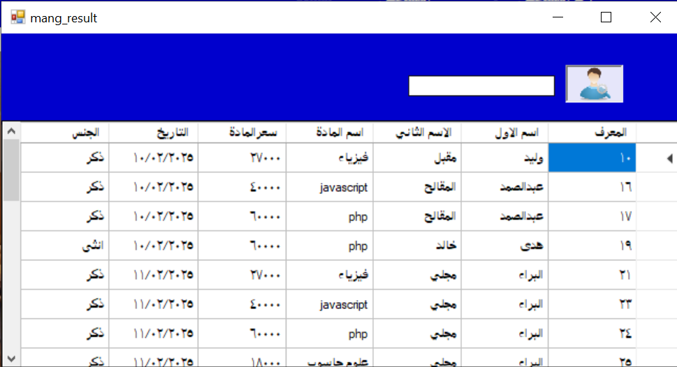
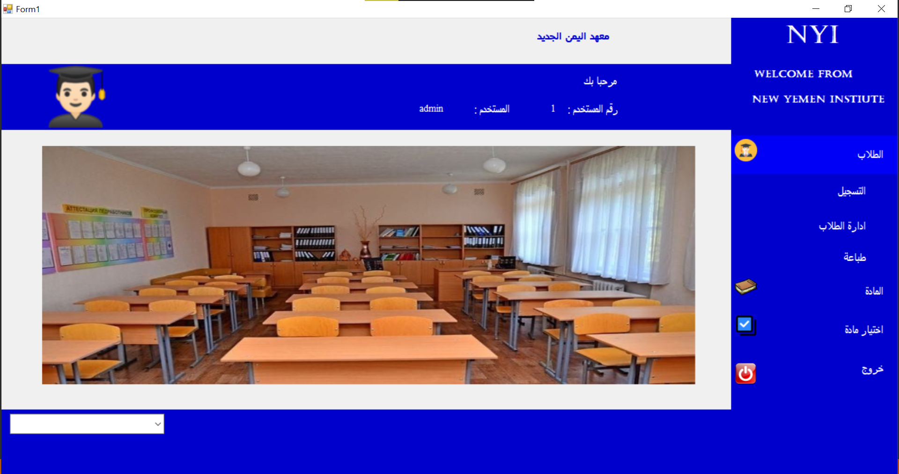

# 🏫 نظام إدارة المدارس (School Management System)

تطبيق سطح مكتب متكامل تم تطويره باستخدام (C# Windows Forms) لإدارة العمليات المدرسية بكفاءة، يشمل إدارة شؤون الطلاب، المواد الدراسية، عمليات التسجيل، واستخراج التقارير المتقدمة.

---

## 🌟 مميزات النظام ولقطات الشاشة (Screenshots)

### 🔐 تسجيل الدخول (Login)
واجهة آمنة لتسجيل دخول مديري النظام والمستخدمين.

### 🏠 الشاشة الرئيسية (Home Dashboard)
لوحة تحكم شاملة توفر وصولاً سريعاً ومنظماً لجميع نوافذ ووظائف النظام.

### 👨‍🎓 إدارة شؤون الطلاب (Student Management)
نظام متكامل لإضافة وتعديل وحذف بيانات الطلاب.
* **إضافة طالب جديد:**

* **تعديل وحذف بيانات الطلاب:**

### 📚 إدارة المواد الدراسية (Subject Management)
إضافة وإدارة الدورات والمواد الدراسية المتوفرة في المدرسة.
* **إضافة مادة دراسية:**

* **تعديل وحذف المواد:**

### 📝 التسجيل الأكاديمي (Enrollment)
ربط وتسجيل الطلاب في المواد والدورات الدراسية المتاحة.

### 🔍 نظام البحث المتقدم (Search)
شاشة مخصصة للبحث السريع والدقيق عن السجلات والطلاب داخل قاعدة البيانات.

### 🖨️ التقارير والطباعة (Crystal Reports)
توليد وطباعة تقارير احترافية ومفصلة لبيانات الطلاب باستخدام تقنية Crystal Reports.

---

## 🛠️ التقنيات المستخدمة
* **لغة البرمجة:** C# (C-Sharp)
* **الواجهة الأمامية:** Windows Forms (.NET Framework)
* **نظام التقارير:** SAP Crystal Reports
* **قاعدة البيانات:** SQL Server / ADO.NET

## ⚙️ طريقة التشغيل محلياً
1. قم باستنساخ المستودع: `git clone https://github.com/en-Amrsaad/School-Management-System.git`
2. افتح ملف الحل `project.school.sln` باستخدام برنامج **Visual Studio**.
3. تأكد من إعداد سلسلة الاتصال بقاعدة البيانات (Connection String) بشكل صحيح.
4. تأكد من تثبيت حزمة **Crystal Reports** الخاصة بـ Visual Studio لضمان عمل التقارير.
5. اضغط على `Start` لبناء وتشغيل النظام.
